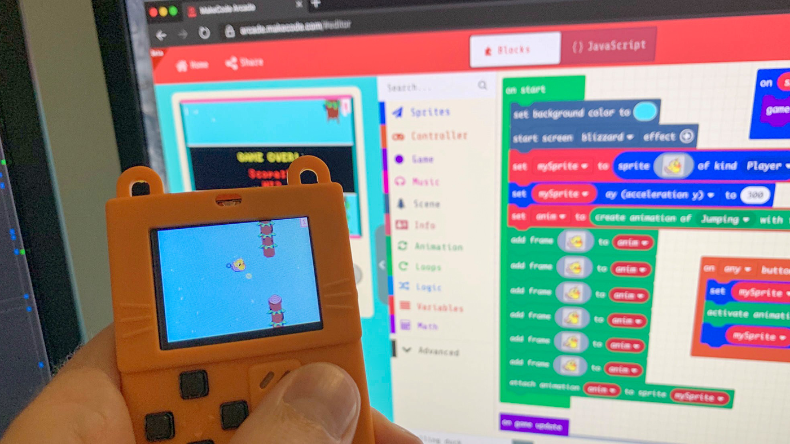

<em>Source: [Microsoft Research Blog](https://www.microsoft.com/en-us/research/blog/rocket-fast-embedded-typescript-for-makecode-arcade/) </em>

# 🧾 Content Outline

## 🧩 MakeCode Platform

- For Students
  - [Introduction](/makecode-docs/student-docs/1.%20introduction.md)
  - [MakeCode Platform](/makecode-docs/student-docs/2.%20makecode-platform.md)
  - [MakeCode Domains](/makecode-docs/student-docs/3.%20makecode-domains.md)
  - [MakeCode Arcade](/makecode-docs/student-docs/4.%20makecode-arcade.md)
- For Educators
  - [MakeCode for Classroom](/makecode-docs/educator-docs/1.%20makecode-for-classroom.md)
  - [MakeCode Education at a Glance](/makecode-docs/educator-docs/2.%20makecode-edu-at-a-glance.md)
  - [MakeCode for Development](/makecode-docs/educator-docs/3.%20makecode-for-development.md)

---

## 🚩 Hour of Code

- [Introduction](/hourofcode-docs/introduction.md)
- Get Started with Hour of Code
  - [Learners Guide](/hourofcode-docs/Getting%20Started%20with%20Hour%20of%20Code/learners%20guide.md)
  - [Parent-teacher guide](/hourofcode-docs/Getting%20Started%20with%20Hour%20of%20Code/parent-teacher%20guide%20intro.md)
  - [Educators Guide](/hourofcode-docs/Getting%20Started%20with%20Hour%20of%20Code/educators%20guide.md)
- Microsoft Hour of Code Challenge
  - [Introduction](/hourofcode-docs/Microsoft%20Hour%20of%20Code%20Challenge/introduction.md)
  - [2020 Hour of Code Challenge](/hourofcode-docs/Microsoft%20Hour%20of%20Code%20Challenge/2020.md)
  - [2021 Hour of Code Challenge](/hourofcode-docs/Microsoft%20Hour%20of%20Code%20Challenge/2021.md)
- [Conclusion](/hourofcode-docs/Conclusion.md)
