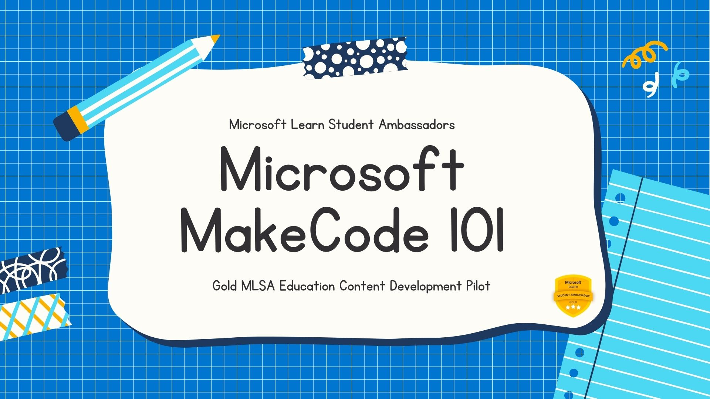

# MakeCode-Documentation



Welcome! This repository contains documentation for [Microsoft MakeCode](https://www.microsoft.com/en-us/makecode) and [Hour of Code](https://hourofcode.com/) as the part of **Microsoft Education Content Development** Pilot by [Gold Microsoft Learn Student Ambassadors](https://studentambassadors.com).

## Folder Structure

```
│
├───README.md
├───OUTLINE.md
│
├───makecode-docs
│    │
│    ├───student-docs
│    |        1. introduction.md
│    |        2. makecode-platform.md
│    |        3. makecode-domains.md
|    |        4. makecode-arcade.md
|    |
│    └───educator-docs
│             1. makecode-for-classroom.md
|             2. makecode-edu-at-a-glance.md
|             3. makecode-for-development.md
|
└───hourofcode-docs
    │   Introduction.md
    │
    ├───Getting Started with Hour of Code
    │         1. learners guide.md
    │         2. parent-teacher guide.md
    │
    ├───Microsoft Hour of Code Challenge
    │         1.  2020.md
    │         2.  2021.md
    │         3.  introduction.md
    └───Conclusion.md
```

## Getting Started

> ### Go through the [Documentation Outline](OUTLINE.md) and get started right away.

- Get started with Microsoft MakeCode - Docs
  - For Students
    - [Introduction](/makecode-docs/student-docs/1.%20introduction.md)
    - [MakeCode Platform](/makecode-docs/student-docs/2.%20makecode-platform.md)
    - [MakeCode Domains](/makecode-docs/student-docs/3.%20makecode-domains.md)
    - [MakeCode Arcade](/makecode-docs/student-docs/4.%20makecode-arcade.md)
  - For Educators
    - [MakeCode for Classroom](/makecode-docs/educator-docs/1.%20makecode-for-classroom.md)
    - [MakeCode Education at a Glance](/makecode-docs/educator-docs/2.%20makecode-edu-at-a-glance.md)
    - [MakeCode for Development](/makecode-docs/educator-docs/3.%20makecode-for-development.md)
- Get Started with Hour of Code - Docs
  - [Introduction](/hourofcode-docs/introduction.md)
  - [Learners Guide](/hourofcode-docs/Getting%20Started%20with%20Hour%20of%20Code/learners%20guide.md)
  - [Parent-teacher guide](/hourofcode-docs/Getting%20Started%20with%20Hour%20of%20Code/parent-teacher%20guide%20intro.md)
  - [Educators Guide](/hourofcode-docs/Getting%20Started%20with%20Hour%20of%20Code/educators%20guide.md)
  - [Microsoft Hour of Code Challenge](/hourofcode-docs/Microsoft%20Hour%20of%20Code%20Challenge)
    - [Introduction](/hourofcode-docs/Microsoft%20Hour%20of%20Code%20Challenge/introduction.md)
    - [2020 Hour of Code Challenge](/hourofcode-docs/Microsoft%20Hour%20of%20Code%20Challenge/2020.md)
    - [2021 Hour of Code Challenge](/hourofcode-docs/Microsoft%20Hour%20of%20Code%20Challenge/2021.md)
  - [Conclusion](/hourofcode-docs/Conclusion.md)

---

## Contribution

Contributions are welcome! Feel free to create a PR if you find any anamolies or typos. For suggesting a full new section, please create an issue for topic.

Follow the [Contribution Guideline](/CONTRIBUTION.md) first before creating a PR.

## Translation

If you would like to translate all or part of the documentation, please follow our [Translations Guide](/TRANSLATIONS.md).

---

## About Education Content Development Project

Under **Community Projects Initiative**, 'Content Development for Education' is 6-week long Education-themed pilot project to develop technical learning documentation that helps a population of early-stage learners and educators better understand how to get started with a Microsoft product.

The project is piloted by the Gold Ambassadors to build contents for [Microsoft MakeCode](https://www.microsoft.com/en-us/makecode) platform and [Hour of Code](https://hourofcode.com/) initiative.

## About Community Projects Initiative

An initiative intended to kickstart project based engagements under **Social Impact** Leagues in _Microsoft Learn Student Ambassadors_ program. It offers the tracks of _Content Development_, _Project Sprint_ and _Workshop Development_.
In essence, it aims to bring a seamless teamwork experience for the ambassadors community.

---

## Meet the Authors

- Bethany Jepchumba
- Anjum Rashid​
- Chioma Mbaoma​
- Rohit Yadav​
- Aditya Oberai​
- Arpita Das
