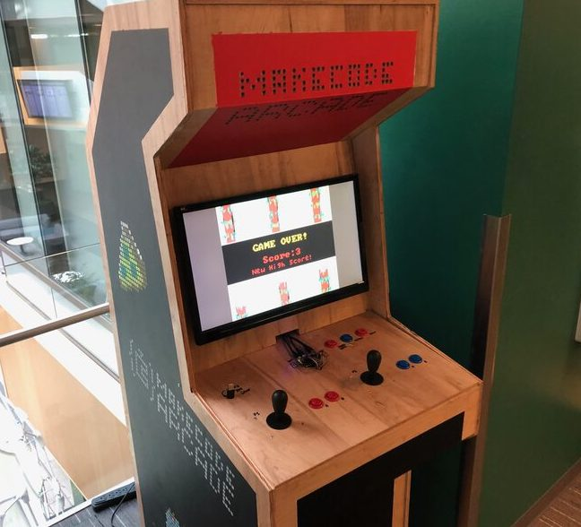
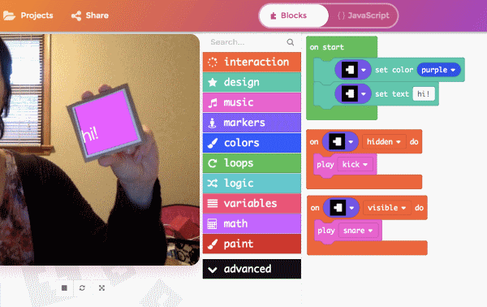

[Back](/makecode-docs/educator-docs/2.%20makecode-edu-at-a-glance.md)

## Microsoft PXT - Programming eXperience Toolkit

 

  <em>Source : <a href="https://arcade.makecode.com/hardware/raspberry-pi/wooden-cabinet">MakeCode Arcade Wooden Cabinet</a></em>

[Programming eXperience Toolkit](https://github.com/microsoft/pxt) is an open source framework offered by Microsoft empowering innovators, educators, developers and researchers to be highly creative in building MakeCode lookalike platforms for CS education with their own flavors.

- It is the special-purpose programming engine powering popular web-based educational editors such as [MakeCode Arcade](https://arcade.makecode.com), [Micro:bit](https://makecode.microbit.org/), [MakeCode for Minecraft](https://minecraft.makecode.com/) and [Chibi Chip](https://makecode.chibitronics.com/).

- Under the hood, it is a TypeScript-driven tool based on [Google Blockly](https://developers.google.com/blockly)

- For those who prefer working in terminals, the framework comes with a command line tool `pxt` for development convenience, available as a Node JS package.

Moreover, [MakeCode community](https://forum.makecode.com/) has contributed to a rich collection of specialized editors suitable for variety of domains. Now you can try out editors fine-tuned for fields such as [Data Science](https://aka.ms/ds), [Augmented Reality](https://laboratoryforplayfulcomputation.github.io/arcadia/), [Face Recognition](https://github.com/JCSPEC/BuildUFace), [3D Printing](https://makecode.buildbee.com/), [Traffic Simulation](https://github.com/liolop/Coraffic) and many more!
 

  <em>Source : <a href="https://makecode.com/labs">MakeCode Labs</a></em>

From academic needs to commercial products - PXT has become the ultimate toolbox for inclusive programming experience.

> 📝 Up for putting together a cool new programming editor of your own? 👉 [Start Today](https://makecode.com/target-creation) 👈 with MakeCode docs!

[Back](readme.md)