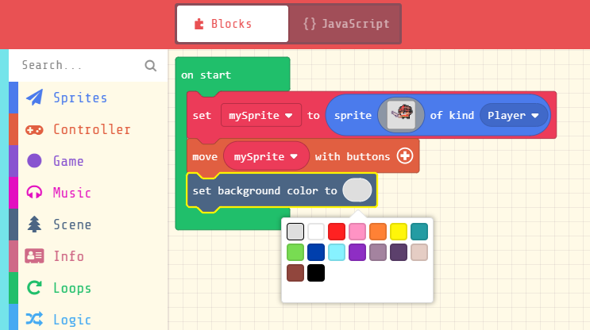
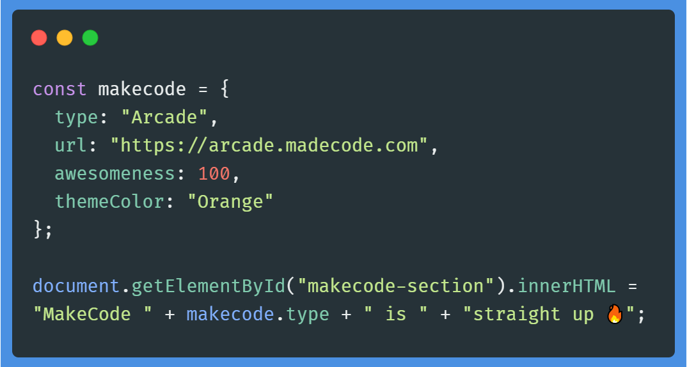

[Back](../../README.md)

# Introduction

## What Is Programming?

**Programming** is essentialy the core medium of humans-to-machine communication. Translating machine instructions, it enables digital devices to perform functions according to our need.

 

  <em>Source: Author</em>

Since the early days of the [Analytical Engine](https://wikipedia.org/wiki/Analytical_Engine) by Charles Babbage, computer programming has gone through a swift ride of development and innovation. Today, building career in tech and enhancing one's skill-set in coding and machine instructions has made this domain extremely popular in the rising generation.

In fact, solving unique problems via programming wonderfully resonates with **Microsoft Corporation**'s co-founder Bill Gates, as he rightfully stated -

> "The computer was born to solve problems that did not exist before."

Disciplines such as education, economics, business and healthcare are heavily incorporating emerging techs with effective algorithms to automate repetitive tasks and achieve breakthroughs. Clearly, programming is at the centre of every technological development.

## Why Should You Choose Programming?

Ever thought of learning to code? Whether you are a student or an educator, being able to code gives one a competitive edge in the technology-driven 21st century.

- Programming empowers one to find innovative ways to approach and tackle a problem. It makes them self-confident, experimental and creative.

- From creating interactive games to building automated healthcare bots, the industrial demand for skilled coders will never fade away in near future. [US Bureau of Labor Statistics](https://www.bls.gov/ooh/computer-and-information-technology/home.htm) has reported it as one of the fastest growing career domains.

- Educational institutions are widely adopting **Computer Science** and **IT** disciplines in their academic curricula. In addition, students who are programmers naturally get an academic advantage.

---

## The Need For Block-based Coding

Programming languages can be treated as different dialects of one mother language, which share the basic programming principles regardless of language types. Since the contemporary programming languages require a steep learning curve and persistent time commitment, developer-friendly languages have emerged to make the learning process convenient.

**Block-based coding** is an human-friendly approach to visual programming. Fundamentally, it helps to quickly grasp the basics including variables, conditionals, functions and loops. It can kickstart one's journey on programming paradigms, logic buildup and problem solving just the same way as traditional text-based languages.

 

 
  <em>Source: <a href="https://makecode.com/blog/arcade/01-18-2019">Block Based Coding (MakeCode Blog)</a></em>

Block coding abstracts away all the intricate details and syntaxes of a [Integrated Development Environment](https://wikipedia.org/wiki/Integrated_development_environment) and makes it way easier to build a logical flow. This is where [Microsoft MakeCode](https://makecode.com), the beginner-friendly programming hub comes into play.

With **Microsoft MakeCode**, students get the exposure to real-world programming, and educators get to leverage a diverse platform to conveniently teach their student community and peers. Moreover, the platform enables one to code both in **Blocks** or contemporary languages such as [JavaScript](https://developer.mozilla.org/en-US/docs/Web/JavaScript) and [Python](https://www.python.org/).

## Why Pick MakeCode?

The best part of choosing this platform is that students can gradually shift to text-based coding languages as soon as they become confident in building blocks. Side-by-side textual and visual editors helps one intuitively make comparisons and develop quick understanding of the language and execution flow.

 

  <em>Text Based Coding</em>

MakeCode effectively paves the way for people from any discipline to make transition into real-world programming and continue creating interactive and engaging experiences.

---

### References

- https://makecode.com/about
- https://www.condecosoftware.com/blog/quick-guide-to-coding/
- https://medium.com/swlh/coding-where-to-start-for-people-without-a-technical-background-7eb96a0fb2b7

[Next](/makecode-docs/student-docs/2.%20makecode-platform.md)