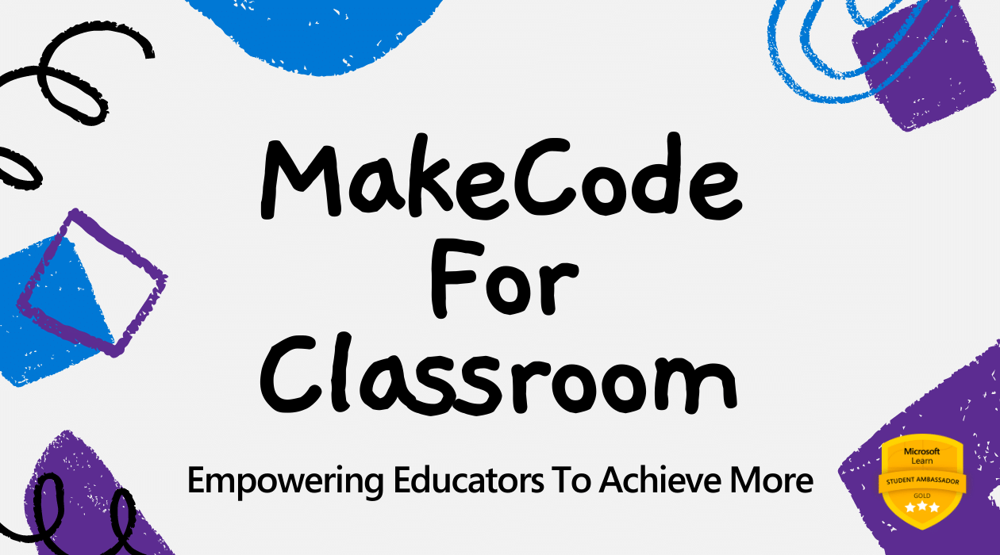
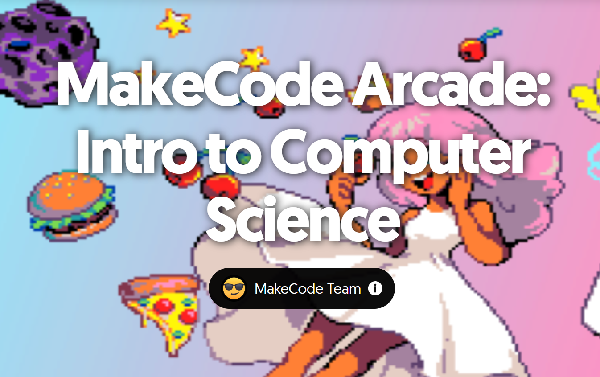
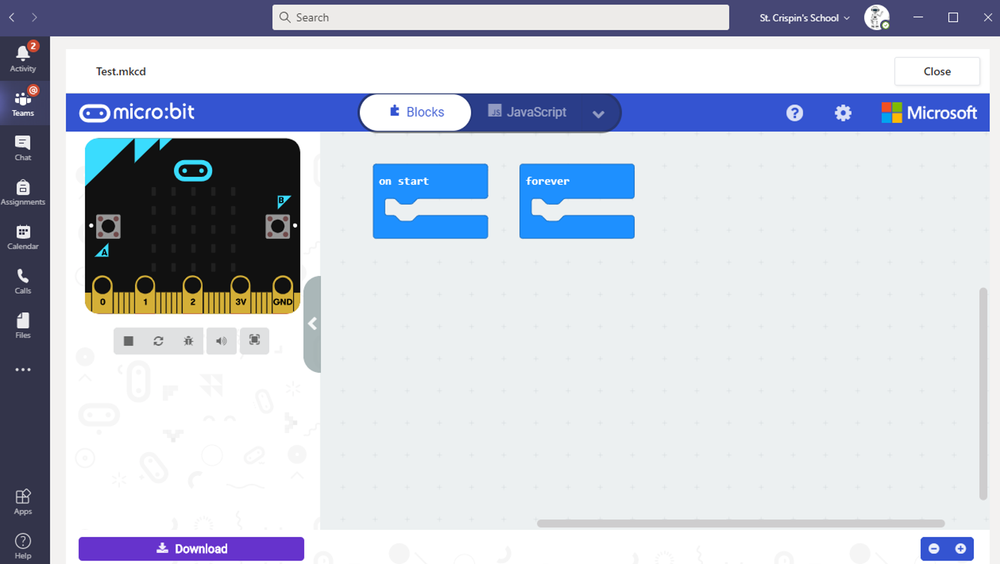
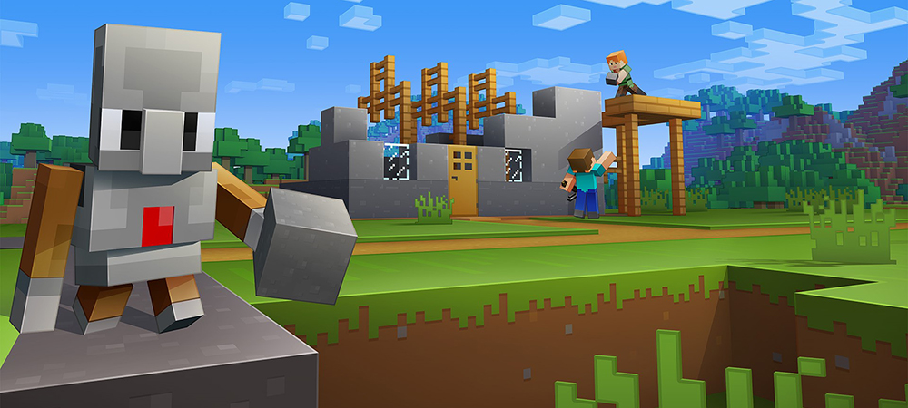
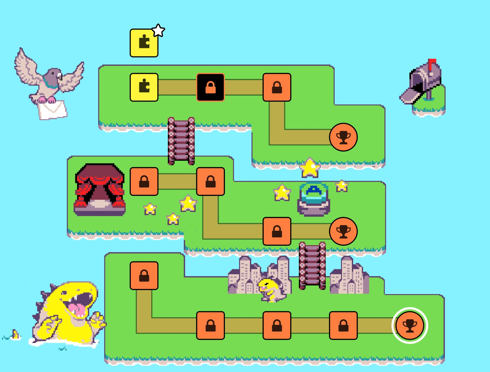

# MakeCode for Classroom

 
 

Since **Microsoft MakeCode** provides a progression path into real-world programming, it can be effectively incorporated into the classroom environment.

> ### Educators can leverage a plethora of free curricula and variety of projects to drive the power of MakeCode into the classroom.

## Introduction to Computer Science

**Computer Science**, being one of the most sought-after disciplines, deals with computers and computational schemes to program devices, develop web applications, train intelligent models, build automatic robots and do a lot more than we can imagine. Computer scientists smartly incorporates technology to solve problems — whether abstract or tangible, and presents us the ways to be future-proof.

### **Introduction to Computer Science** is the free-of-cost curriculum for Educators to teach students Computer Science through game programming and embedded systems.

 
 
  <em>Source: <a href="https://flipgrid.com/csintroarcade">Online Learning with MakeCode</a></em>

There are three compelling mediums available to get learners engaged with the curriculum:

- [Intro to CS with MakeCode Arcade](https://arcade.makecode.com/courses/csintro) : A three part series that teaches newcomers how to code from the ground up using Blocks and JavaScript. Along the way, students get familiarized with essential software development concepts and turn their ideas into implementations.
- [Intro to CS with MakeCode for Minecraft](https://minecraft.makecode.com/courses/csintro) : A semester-long course specially for middle-school students, that teaches core concepts of CS via the interactive gaming environment of **Minecraft**. It is specially curated for teachers fairly new in CS domain.
- [Intro to CS with MakeCode for micro:bit](https://makecode.microbit.org/courses/csintro) : **Micro:bit** is a mini pocket-sized computer packed with inputs, outputs, sensors and wireless transceiver features. The curriculum with this circuit board has the characteristics considerably similar to the previous one.

> 📝 Grab free resources and bring CS education into your classroom 👉 [MakeCode Resources](https://makecode.com/online-learning/resources).

## Classroom Management

Lately, web-based classroom management platforms have been widely adopted for the management and evaluation of students' classworks and assignments.
When it comes to a MakeCode-driven curriculum, these platforms needs to streamline a workflow for submission and evaluation of MakeCode project files.

### To make this simple and smooth, MakeCode has been integrated and embedded right into **Microsoft Teams**.

 

  <em>Source: <a href="https://github.com/microsoft/pxt-microbit/issues/3789">PXT-Microbit GitHub</a></em>

The **Assignment and Grades** features of Teams natively supports Microsoft MakeCode, giving the educators a hassle-free experience to create, assign, naviagate and evaluate such project files seamlessly.

Moreover, MakeCode can be coupled with most _Learning Management Systems_ to create and manage coding assignments. Platforms like _Google Classroom_, _Canvas_ and _Seesaw_ are also compatible with makecode via shared URLs and shared files.

> 📝 Find out more about 👉 [LMS tutorials](https://makecode.microbit.org/online-learning) by micro:bit foundation.

Last but certainly not the least, [micro:bit classroom](https://classroom.microbit.org/) allows teachers to manage and leverage an easy to use virtual classroom environment for guided template sharing, monitoring and assisting the students as they work on their tasks.

---

## Educational Aspects

- **Microsoft Research** and **MakeCode** teams have taken the the coding experience into the next level by bringing it into open-world Minecraft. The [MakeCode for Minecraft](https://minecraft.makecode.com/) editor takes the pixelated appearance of the Minecraft world. It comes in two flavors - [Minecraft for Windows 10](https://www.microsoft.com/en-us/store/p/minecraft-for-windows-10/9nblggh2jhxj) and [Minecraft Education Edition](https://education.minecraft.net/). 
   <em>Source: <a href="https://www.microsoft.com/en-us/research/blog/code-minecraft/">Microsoft Research Blog</a></em>

  Being able to code within Minecraft makes the students, specially the gamers highly engaged to play and learn. Thus educators get to create a super fun environment in the classroom while covering the curicullum along the way.

- Fresh Educators in STEM field can achieve recognition from Microsoft by successfully completing [STEM Level I Specialization](https://education.microsoft.com/en-us/learningpath/9a894a16) learning path. This series of courses includes physical computing with MakeCode, Minecraft Education training and first exposure to _Hour of Code_.

- [Arcade Beginner Skillmap](https://arcade.makecode.com/--skillmap#beginner) combines skill-based learning with gamified experience. Teachers can conveniently teach how to get started with game design and development. 

   <em>Source: <a href="https://arcade.makecode.com/--skillmap#beginner">MakeCode Arcade Website</a></em>

- Guided project with microcontrollers such as _Adafruit Circuit Playground Express_ is an intutive way to challenge students and stir up creativity, logical thinking, and collaboration skills. Moreover, for a broader audience, organizing _MakeCode Powered Hack Challenges_ would assist learners to incorporate technology and use the knowledge gathered from academic curriculum to bring their ideas into reality.
- [MakeCode in the Kitchen](https://youtube.com/playlist?list=PLMMBk9hE-SerWvHZva9o9RFpGk2aY6d40) is a home education series which deals with creating DIY projects suitalable for children using micro-controller boards like _Circuit Playground Express_. Creating educational tutorials online is a great way to engage in e-learning.

- [MakeCode Educators Lounge](http://aka.ms/EducatorsLounge) is a community of educators, partners, extension authors for discussing ideas, getting assistance, sharing projects, and interacting with the product team. The vibrant forum has made the gamified education accessible to student around the globe.

> 📝 [Subscribe](https://www.youtube.com/channel/UCye7YlvFUUQ1dSy0WZZ1T_Q?sub_confirmation=1) to Microsoft MakeCode's [official channel](https://www.youtube.com/c/MicrosoftMakeCode/) for unlimited contents to make magic happen with the power of code!
