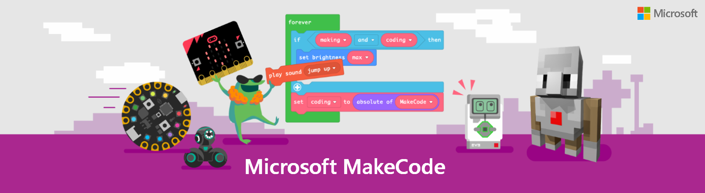

# MakeCode Platform

 
  <em>Source: <a href="https://makecode.com/online-learning">MS MakeCode Website</a></em>

## What is MakeCode?

> ### [Microsoft MakeCode](https://makecode.com) is a unified ecosystem to empower students from any background to build fun programs with blocks and learn programming fundamentals along the way. Being a **FOSS** (Free and Open Source) tool, it supports a progression path into real-world programming and core concepts of Computer Science.

## What Learning Methods Does MakeCode Offer?

MakeCode supports the following learning methods and languages:

- An **interactive simulator** which provides students with immediate feedback on how their program is running and makes it easy to test and debug their code.

- A **Block Editor** which can be used by students new to coding to construct programs. Colored blocks which can be dragged and dropped onto a workspace are used in this case.

- A **JavaScript / Python Editor** is also provided to help students use their preferred language to create programs. The editor features code snippets, tooltips, and error detection.

> 📝 Did you know you can find super fun coding shorts at official MakeCode Tiktok? [Follow](https://www.tiktok.com/@msmakecode) right away.
