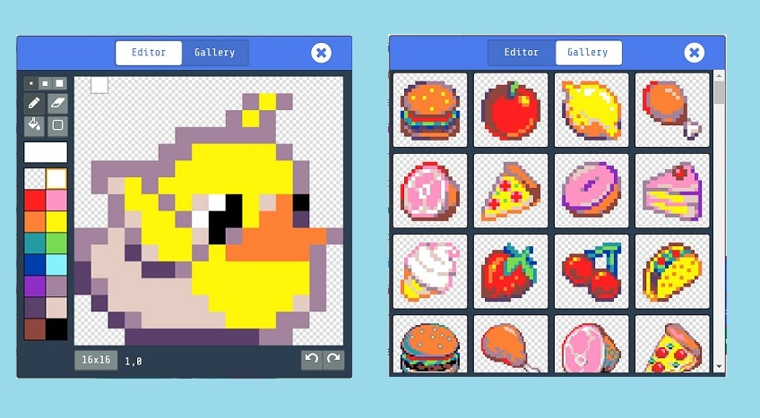

# MakeCode Arcade Platform

\
_Source :_ [_MakeCode Blog_](https://makecode.com/blog/arcade/01-18-2019)

## MakeCode Arcade Features

Powered by 2D gaming engine, **MakeCode Arcade** makes retro gaming from any modern web browser a seamless experience. It supports a wide range of features:

* Game APIs with modern programming language aspects such as classes, interfaces, higher order functions, fixed point arithmetic, and garbage collection
*   _Sprite Designer_ ( 8x8 and 32x32 dimensions ) embedded right into game editor

    \

\
_Source :_ [_MakeCode Blog_](https://makecode.com/blog/arcade/01-18-2019)

* Game pre-packaged with a set of game APIs:
  * **Sprite:** physics, effects, collisions, animations and lifetime management
  * **Controllers:** Single-player or multi-player
  * **Music:** 4-channel sound with different waveforms and envelopes
  * **Game updates:** prompts and dialogs
  * **Scene:** Tilemaps, collisions, particle system and camera positioning
* Projects collaboration, package management and project showcasing with **GitHub** integration
* Seamless interoperability from cloud to endpoints with [Cloud Sync](https://makecode.com/blog/arcade/intro-cloud-sync)
* Supports _microcontrollers_ and a wide variety of customization choices for dedicated harwares
* JavaScript and Pythod editors come with modern IDE features such as auto-completion and IntelliSense.

> 📝 Ever thought about joining a community that shares and celebrates dazzling makecode projects? Take a visit to 👉 [MakeCode forum](https://forum.makecode.com) 👈!

## Arcade Interface

The arcade's interface as shown below consists of the following:

* **A game screen:** This is labelled as `1`, on the leftmost part of the screen. It serves as the visual interface to interact with the simulated game.
* **The code blocks:** This is labelled as `2`. It contains all the code blocks we can use in building our program - grouped into sections.
* **The scripting area:** This is labelled as `3`. It is the wide area where we place our blocks on.
* **Save project:** These are labelled as `4`. Clicking the save button will save our program, so we can return to it at anytime while clicking the GitHub button creates a repository for us, to hold the code used in building our program.
* **Undo/Redo and accessiblity:** These are labelled as `5`. Clicking the undo icon reverts the change and the redo icon can be clicked to take us to a more current phase. The zoom icons (zoom out and zoom in), can be used to adjust the size of the window we are working on.
